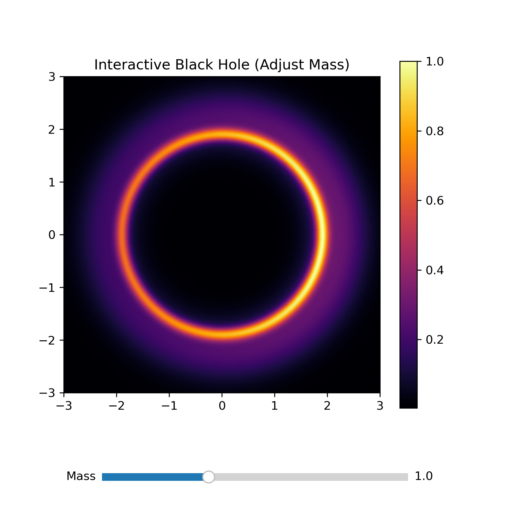
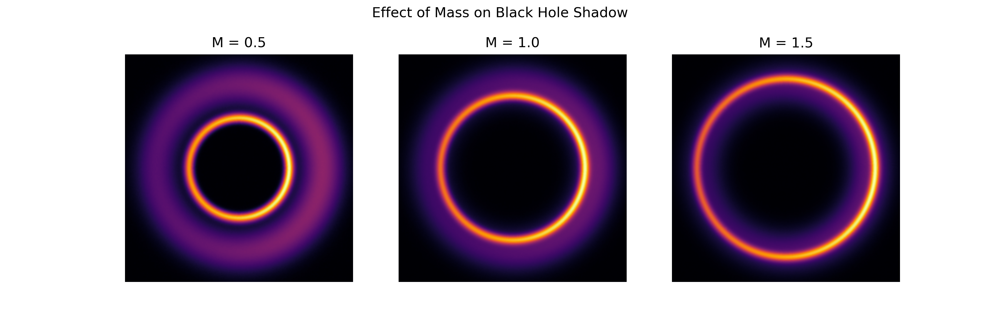
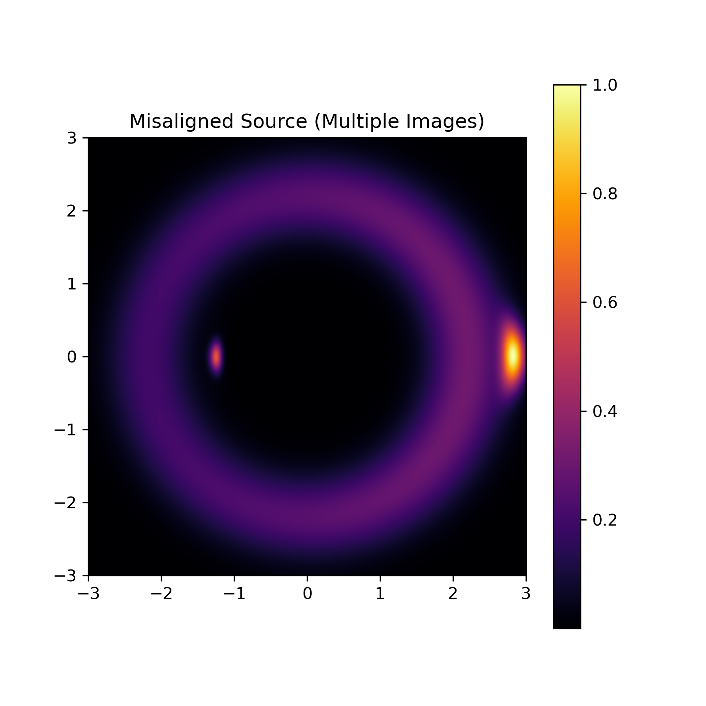

# Black Hole Lensing Simulation

## Overview

This project simulates **gravitational lensing** and **black hole shadow formation** using Python.
It shows how light bends near a black hole, distorting background stars and forming a shadow region.

## Physics Background

Massive objects like black holes curve spacetime.
Light follows this curvature, which leads to:

* Gravitational lensing
* Einstein rings
* Black hole shadow formation

## Features

* Interactive lensing simulation
* Mass variation effects
* Misaligned lensing case
* Star field distortion

## Results

### Black Hole Shadow

### Mass Variation

### Misaligned Case

## How to Run

1. Open `Black_hole.ipynb`
2. Run all cells

## Technologies Used

* Python
* NumPy
* Matplotlib
* SciPy

## Future Improvements

* Add rotating black holes (Kerr metric)
* Improve physical accuracy
* Add animation

## Author

Vanshika Modi
